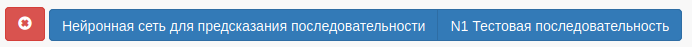
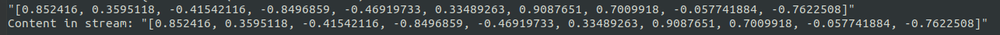

### Agent of neural network run

This agent allows you to run ANN on the data given.

#### Work example

1. Choose ANN and file nodes

2. Get the menu action

3. See the results in console and in KB directory (if ANN can provide)

4. Rebuild KB to see new media attached (if ANN can provide)

