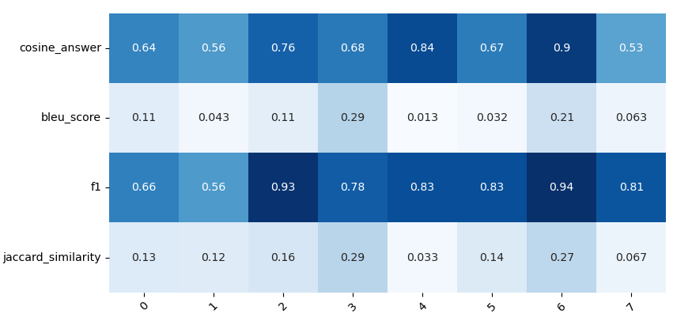
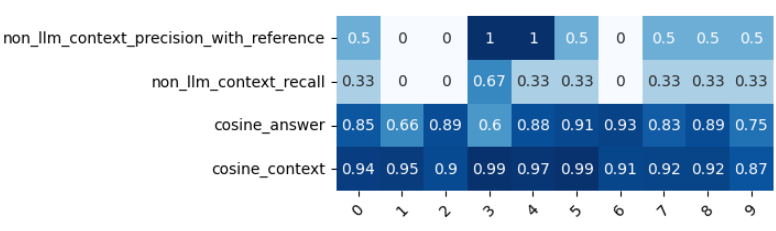

# Оценка работы API RAG-приложения
## Главные библиотеки и подходы в оценке
- ### **sklearn (cosine_similarity)**
- ### **requests**
- ### **bleu_score**
- ### **Jaccard similarity**
- ### **f1 Score**

## Методы оценки

- ### Функция для избавления от знаков препинания и заглавных букв.

```python
def preprocess_text(text):
    text = re.sub(r'[^\w\s]',"",text)
    text = text.lower()
    return text
```

- ### **cosine_similarity**
Функция, находящая косинусное расстояние между полученным результатом и итоговый результатом. 
```python
def calculate_cos_query(response,reference):
    resp = embedding_function.embed_query(response)
    refr = embedding_function.embed_query(reference)
    resp = np.array(resp).reshape(1, -1) 
    refr = np.array(refr).reshape(1, -1)
    result = cosine_similarity(resp,refr)
    return result[0][0]
```


- ### **requests**
***Библиотека, которую будем использовать для обращения к нашему приложению по url-адрессу.***


- ### **Bleu score**

Считает насколько предложение соответствует n-грамме. В нашем случае n=2. Это значит, мы проверяем, сколько последовательностей из 2 слов в ответе системы совпадают с последовательностями из 2 слов в ожидаемом ответе.

*Стоит отметить, что данный метод очень требователен к самим словам. То есть он не учитывает синонимичность слов.*

``` python
def calculate_bleu_score(response,reference):
    reference_tokens = reference.split()
    responce_tokens = response.split()
    smoothin_func = SmoothingFunction().method1
    score = sentence_bleu([reference_tokens],responce_tokens,weights=(0.5,0.5,0,0),smoothing_function=smoothin_func)
    return score
```

В коде weights = (0.5,0.5,0,0) означают значимость совпадения слов в последовательности из 4 слов.

[Подробнее об этом на официальном сайте библиотеки nltk](https://www.nltk.org/_modules/nltk/translate/bleu_score.html)


- ### **Jaccard similarity**
Данный метод считает насколько полученный ответ соответствует эталонному.
 
*Стоит отметить, что данный метод очень требователен к самим словам. То есть он не учитывает синонимичность слов.*

``` python
def calculate_jaccard_similarity(response, reference):
    response_set = set(response.split())
    reference_set = set(reference.split())
    intersection = len(response_set.intersection(reference_set))
    union = len(response_set.union(reference_set))
    return intersection / union if union != 0 else 0
```


- ### **F1 score**

F1 строится на двуз основных понятиях:
- Точность (precision)
= какая доля от предсказанных результатов соответствует желаемым.

- Полнота (recall)
= какая доля от предсказанных результатов была найдена из всех возможных

И из этих чисел находят гармоническое среднее

*Стоит отметить, что данный метод очень требователен к самим словам. То есть он не учитывает синонимичность слов.*

``` python
def calculate_f1_score(response,reference):
    ref_tokens = set(reference)
    res_tokens = set(response)
    common = ref_tokens.intersection(res_tokens)
    
    if len(common) == 0:
        return 0.0
    
    precision = len(common) / len(res_tokens)
    recall = len(common) / len(ref_tokens)
    f1 = 2 * (precision * recall) / (precision + recall)
    return f1
```

### ___F1 Score=2⋅(Precision*Recall)/(Precision+Recall)___
​

[Подробнее об этом на вики](https://en.wikipedia.org/wiki/F-score)

## Алгоритм оценки rag-приложения

### 1.Инициализируем свой набор данных
### 2.Загружаем файл через requests
### 3.Обрабатываем вопросы из набора данных
### 4.Оценка ответов
### 5.Построение таблицы для анализа полученных результатов

## 1.Инициализация своего набора данных
``` python
dataset = [
    {
        "question": "Что изучает механика?",
        "answer": "Механика изучает механическое движение тел, то есть изменение их положения в пространстве относительно других тел с течением времени."
    }
    ...
]
```
## 2.Загрузка файла 
``` python

 with open(filename, "rb") as f:
        files = {'file': (f.name,f,'pdf')}
        response = requests.post("http://localhost:8000/upload-doc", files=files)
        assert response.status_code == 200

```
## 3.Обработка вопросов
```python
for example in dataset:
    data = {
        "question":example['question'],
        "model":"llama3.2"
    }
    
    response = requests.post("http://localhost:8000/chat",headers=headers, json=data)
    assert response.status_code == 200
    res = response.json()
    ...

```
## 4.Оценка ответов
```python
    preprocessed_reference = preprocess_text(example['answer'])

    ...
    
    answer_as_example = preprocess_text(answer_as_example)
    
    cosine_answer = calculate_cos_query(answer_as_example,preprocessed_reference)
    bleu_score = calculate_bleu_score(answer_as_example,preprocessed_reference)
    f1 = calculate_f1_score(answer_as_example,preprocessed_reference)
    jaccard = calculate_jaccard_similarity(answer_as_example, preprocessed_reference)

    metrics.append(
        {
            "cosine_answer": cosine_answer,
            "bleu_score": bleu_score,
            "f1": f1,
            "jaccard_similarity": jaccard,
        }
    )
    ...
```
## 5.Таблица результатов



------------------------

# ***Оценка работы retriever вне всей системы***
## Главные библиотеки и подходы в оценке
- ### **ragas (NonLLMContextPrecisionWithReference)**
- ### **ragas (NonLLMContextRecall)**
- ### **sklearn (cosine_similarity)**

## Методы оценки

- ### **cosine_similarity**
Функция, находящая косинусное расстояние между полученным результатом и итоговый результатом. 
```python
def calculate_cos_query(response,reference):
    resp = embedding_function.embed_query(response)
    refr = embedding_function.embed_query(reference)
    resp = np.array(resp).reshape(1, -1) 
    refr = np.array(refr).reshape(1, -1)
    result = cosine_similarity(resp,refr)
    return result[0][0]
```
- ### NonLLMContextPrecisionWithReference
    [Ссылка на официальную документацию по этому классу](https://docs.ragas.io/en/stable/concepts/metrics/available_metrics/context_precision/#non-llm-based-context-precision)
- ### NonLLMContextRecall
    [Ссылка на официальную документацию по этому классу](https://docs.ragas.io/en/stable/concepts/metrics/available_metrics/context_recall/#non-llm-based-context-recall)
## Алгоритм оценки

### 1.Загрузка набора данных
### 2.Добавление контекстов из набора данных в временное хранилище
### 3.Обработка вопросов из набора данных с помощью rag-приложения и создание нового набора на основе ответов.  
### 4.Оценка получившегося набор данных с помощью метрик
### 5.Построение таблицы для анализа полученных результатов

#

### В рабочем пространстве должна быть создана папка benchmark

## 1.Этап загрузки данных
``` python
dataset = load_dataset(
    "explodinggradients/amnesty_qa",
    "english_v3",
    trust_remote_code=True
)

eval_dataset = dataset["eval"].select(range(10))
```

## 2.Этап добавления контекстов
``` python
documents = [Document(page_content="".join(example['retrieved_contexts'])) for example in eval_dataset]

split_documents = text_splitter.split_documents(documents)

temp_vectorstore = Chroma(persist_directory=temp_dir.name, embedding_function=embedding_function)

temp_vectorstore.add_documents(split_documents)
```

## 3.Этап создания нового набора данных
``` python
system_answers = []
cos_distance = []
for example in eval_dataset:  
    
    question = example["user_input"]  
    reference = example["reference"] 
    reference_contexts = example['retrieved_contexts']
    
    response = process_question_with_rag(question)
    
    retrieved_contexts = [i.page_content for i in response['context']]
    
    cossim = calculate_cos(response['answer'],reference)
    cos_distance.append(cossim)
    
    system_answers.append({"user_input": question,
                           "reference":reference,
                           "response": response['answer'],
                           "retrieved_contexts":retrieved_contexts,
                           "reference_contexts": reference_contexts})
```
## 4.Этап оценки нового набора данных
``` python
answers_df = pd.DataFrame(system_answers)
answers_df.to_csv("./benchmark/system_answers.csv", index=False)
eval_dataset_for_metrics = EvaluationDataset.from_pandas(answers_df)
metrics = [
    NonLLMContextPrecisionWithReference(),
    NonLLMContextRecall()
]

results = evaluate(dataset=eval_dataset_for_metrics, metrics=metrics)

results_df = results.to_pandas()
results_df['cosine_similarity'] = cos_distance
```
## 5.Этап построения таблицы
``` python
sns.heatmap(results_df.iloc[:,5:].T, annot=True,linewidths= 2,square = True,
            cmap="Blues",
            )
plt.xticks(rotation=45)

plt.show
```
### В нашем случае таблица выглядит следующим образом:

